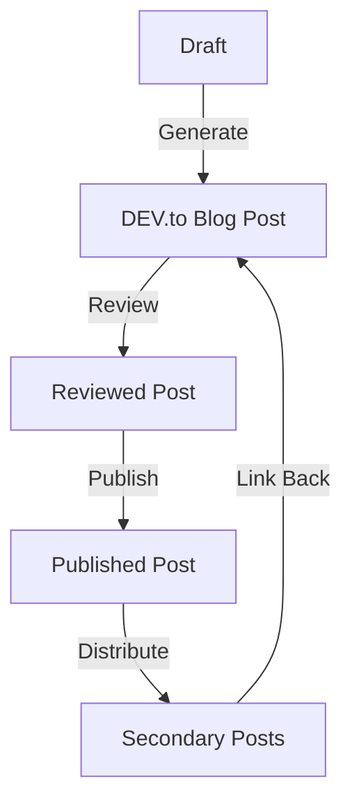

# Social Media Content Pipeline

This project uses [PR Pilot](https://www.pr-pilot.ai) to implement a social media content pipeline. From an initial draft, a DEV.to article is generated, which contains the main post. Secondary posts are generated for other platforms and linked back to the original post.




## Pipeline Stages

The pipeline has five stages:
- 1️⃣ **Draft** - Drafts are stored as Markdown files in the `drafts` directory.
- 2️⃣ **Generate** - From the draft, a DEV.to blog post is generated.
- 3️⃣ **Review** - The generated post is reviewed and edited before being published.
- 4️⃣ **Publish** - The post is published on the DEV Community platform.
- 5️⃣ **Distribute** - Secondary posts for other platforms are generated, linked to the original post, and published.

## Project Structure

All content is organized in the following structure:
- `drafts/` - Contains all draft content
- `posts/` - Contains all generated posts
- `dist/` - Contains all distributed posts
- `prompts/` - Contains prompts for generating posts

## How to Use

Use the pilot commands in this directory to run the pipeline stages.

```shell
➜  social-media git:(create-a-draft-for-a) ✗ pilot run
Usage: pilot run [OPTIONS] COMMAND [ARGS]...

  🚀 Run a saved command.

  Create new commands by using the --save-command flag when running a task.

Options:
  --help  Show this message and exit.

Commands:
  draft          Answer a few questions and create a new draft
  generate-post  Generate a post for a specific platform
```

### 1️⃣ Draft
PR Pilot will [ask you a series of questions](./prompts/draft-post.md.jinja2) to draft a new social media post. The draft will be saved in the [drafts/](./drafts) directory.

Run: `pilot run draft`


### 2️⃣ Generate

Based on your draft, PR Pilot will generate a DEV.to blog post. The post will be saved in the [posts/](./posts) directory.

Run: `pilot run generate-post`


### 3️⃣ Review

Review the generated post in the [posts/](./posts) directory. You can ask PR Pilot to make the changes for you:

```shell
pilot run edit-post  
```

### 4️⃣ Publish
You can publish your post using the [upload_devto_article.py](./upload_devto_article.py) script. It will automatically
create a new post or update the existing:
```shell
python upload_devto_article.py

1. story-of-pr-pilot.md
2. README.md
3. beautiful-pr-descriptions.md
Select a post to publish: 3
Article already published with ID 1989749, updating...
Article updated successfully!

```